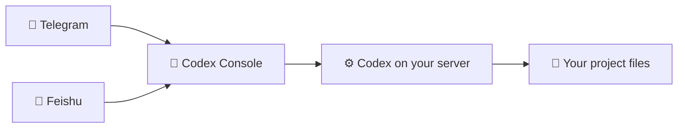

<!-- docmeta
role: entry
layer: 1
parent: null
children: []
summary: public repository entry point for Codex Console and its documentation trees
read_when:
  - first entry into the repository
  - need to choose between human docs and coding-agent routing
skip_when:
  - the exact domain doc or source file is already known
source_of_truth:
  - README.md
  - docs/INDEX.md
  - AGENTS.md
-->

<h1 align="center">Codex Console</h1>

<p align="center">
  <strong>Control Codex from chat. No terminal. No laptop. Just your phone.</strong>
</p>

<p align="center">
  <a href="https://github.com/InDreamer/telegram-codex-bridge/actions/workflows/ci.yml"></a>
  <a href="https://github.com/InDreamer/telegram-codex-bridge/stargazers"></a>
  <a href="https://github.com/InDreamer/telegram-codex-bridge/releases"></a>
  = 24">
  
</p>

---

## The Problem

Codex on a VPS is powerful. But reaching it from your phone through a raw SSH session is awful — no project awareness, no structured feedback, no approval flow. Just a wall of text in a tiny terminal.

## The Solution

Codex Console turns supported chat platforms into **native control surfaces** for your existing Codex installation. It's not a second Codex, not a chatbot wrapper — it's a proper remote control.

This repository/package is still named `telegram-codex-bridge` for compatibility. The product name is **Codex Console**. The internal shared architecture is **Codex Bridge Core**. Telegram is the stable first platform pack and default install path; Feishu is a serious current platform pack. That does not mean every surface is fully platform-neutral yet.



## Quick Install

### Default: Telegram skill path

```bash
curl -fsSL https://raw.githubusercontent.com/InDreamer/telegram-codex-bridge/master/scripts/install-skill-from-github.sh | bash
```

Then tell Codex:

```
Use $telegram-codex-linker to set up my Telegram bridge.
```

The skill handles bridge install, token collection, authorization, and verification. This is the default quick path because Telegram is the stable first pack.

### Feishu pack path

```bash
curl -fsSL https://raw.githubusercontent.com/InDreamer/telegram-codex-bridge/master/scripts/install-skill-from-github.sh | bash -s -- --pack feishu
```

Then tell Codex:

```
Use $feishu-codex-linker to set up my Feishu bridge.
```

Feishu setup requires a Feishu self-built app, `FEISHU_APP_ID` / `FEISHU_APP_SECRET`, long connection, message receive events, and card callbacks. Use the pack-aware admin docs for the exact checklist and verification flow; do not assume every Telegram UX is equally native in Feishu.

### Alternative: Direct install

Telegram default:

```bash
curl -fsSL https://raw.githubusercontent.com/InDreamer/telegram-codex-bridge/master/scripts/install-from-github.sh | bash -s -- \
  --pack telegram \
  --telegram-token "<YOUR_BOT_TOKEN>" \
  --project-scan-roots "$HOME/projects:$HOME/work"
```

Feishu:

```bash
curl -fsSL https://raw.githubusercontent.com/InDreamer/telegram-codex-bridge/master/scripts/install-from-github.sh | bash -s -- \
  --pack feishu \
  --pack-option app-id="<FEISHU_APP_ID>" \
  --pack-option app-secret="<FEISHU_APP_SECRET>" \
  --project-scan-roots "$HOME/projects:$HOME/work"
```

### Requirements

- An always-on Linux or macOS machine
- An existing [Codex](https://codex.new) installation
- A Telegram bot token for the default pack (from [@BotFather](https://t.me/BotFather)), or the matching credentials for another supported pack
- Node >= 24 (if building from source)

## Who This Is For

- You already run Codex on a server, desktop, or always-on machine
- You want a cleaner phone workflow than SSH plus tmux
- You prefer self-hosted tools and explicit operator control
- You are okay with a chat control surface being the control plane into a high-trust runtime

## What You Get

### Project-Aware Sessions

Run `/new` and **choose your project** before starting. No blind execution, no guessing which directory you're in.

### Runtime Visibility

Watch task progress through clean **runtime cards** instead of terminal noise. Use `/inspect` for details, `/where` for current location.

### Approval Flows in Chat

When Codex needs your input — approval, questionnaire, or a decision — the bridge renders it as native control-surface UI. No raw protocol messages.

### Rich Input

- Send a **photo/image** through supported media paths and map it to Codex image input
- Telegram can turn **voice messages** into transcribed text when voice input is enabled; Feishu voice input is not a current capability
- Skills, mentions, and local-image inputs are part of the stable Telegram/default-pack UX; other packs expose them according to their capability tier

### Session Management

Archive, unarchive, rename, and switch between sessions — organized for the active chat surface but linked to your server projects. Platform-specific affordances such as pinning depend on the active pack.

### Full Command Surface

Telegram exposes the reference command surface. Feishu can route the shared command flows through text commands and adapted card surfaces, while its native bot menu intentionally starts smaller.

| Command | What it does |
|---------|-------------|
| `/new` | Start a new session with project picker |
| `/sessions` | List and switch between sessions |
| `/resume` | Pick a Codex history session for the current project |
| `/inspect` | Detailed view of current activity |
| `/interrupt` | Stop a running task |
| `/review` | Review changes in current session |
| `/rollback` | Undo changes |
| `/model` | Switch models and reasoning effort |
| `/plan` | Toggle plan mode |
| `/compact` | Compact conversation context |
| `/browse` | Read-only file browser |
| `/plugins` `/apps` `/mcp` | Manage extensions |

## How It Works

```
You (Telegram or Feishu) → Codex Console (on your server) → Codex app-server → your project files
```

- **Telegram** is the stable first control surface and default pack
- **Feishu** is a current pack for operators who choose it
- **Codex Console** translates between chat UX and Codex protocol
- **Codex** remains the execution engine
- Everything runs on **your machine** — self-hosted, single-user, high-trust

## What It Is Not

- Not a second Codex — it controls your existing one
- Not a multi-user team bot — it's a personal remote control
- Not a fake terminal in chat — it's a proper native UI
- Not a provider layer — your Codex config handles that

## After Install

The `ctb` CLI manages your bridge:

```bash
ctb service run         # Start the bridge
ctb status              # Health check
ctb authorize pending   # Bind your active-pack account (one-time)
ctb doctor              # Run diagnostics
ctb update              # Self-update
```

Service management is built in — systemd on Linux, LaunchAgent on macOS.

## Development

```bash
npm ci                  # Install dependencies
npm run check           # Type-check
npm run test            # Run tests
npm run build           # Build
npm run dev             # Dev mode with hot reload
```

## Documentation

For detailed docs, start here:

- [`docs/INDEX.md`](docs/INDEX.md) — canonical documentation router
- [`docs/README.md`](docs/README.md) — documentation map
- [`docs/product/v1-scope.md`](docs/product/v1-scope.md) — product boundary and trust model
- [`docs/architecture/platform-capability-matrix.md`](docs/architecture/platform-capability-matrix.md) — Telegram/Feishu capability matrix and future Web/App target rows
- [`docs/operations/install-and-admin.md`](docs/operations/install-and-admin.md) — admin reference
- [`docs/architecture/current-code-organization.md`](docs/architecture/current-code-organization.md) — code organization

For coding agents, see [`AGENTS.md`](AGENTS.md).

## Contributing

Read [`CONTRIBUTING.md`](CONTRIBUTING.md), keep the scope tight, and update the matching docs when behavior changes.

## If This Is Useful

Star the repo, try it on a real Codex host, and [open an issue](https://github.com/InDreamer/telegram-codex-bridge/issues) if the install flow or chat UX still feels rough.

---

<p align="center">
  <strong>Built by <a href="https://github.com/InDreamer">VainProphet</a></strong> — a prophet who ships tools, not predictions.
</p>
